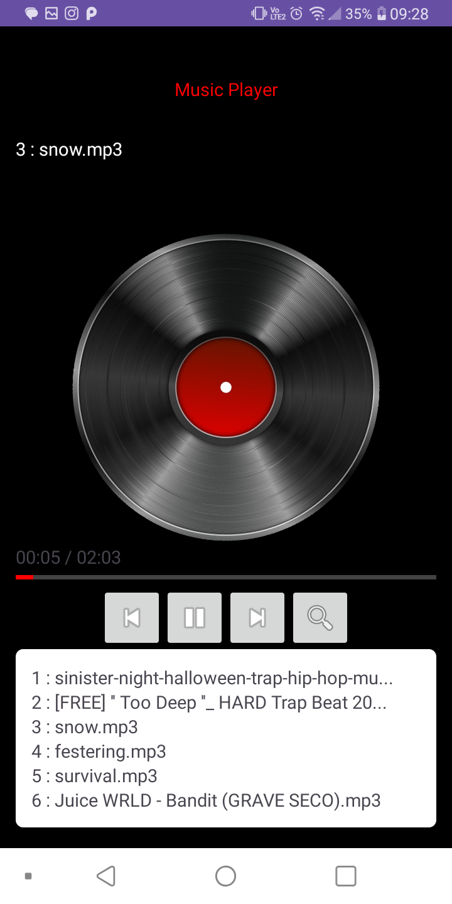
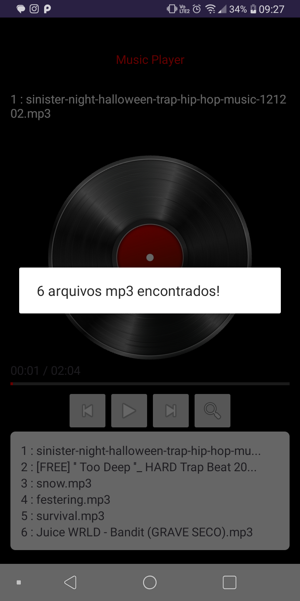
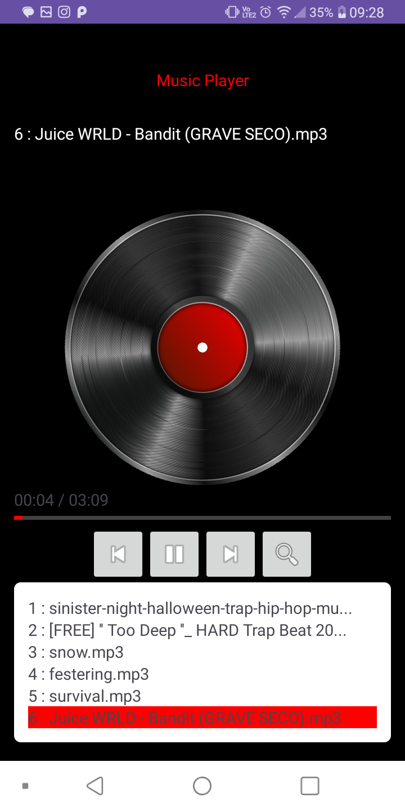

# Music Player Android




Este é um Music Player simples desenvolvido para dispositivos Android usando a linguagem Kotlin. É um projeto open-source que pode ser facilmente baixado, compilado e executado em seu dispositivo Android.

## Video
https://drive.google.com/file/d/187GA_dj0Q4iN78mSmUUB3tAFY9TGSAuF/view?usp=drive_link

## Características

- Sistema de busca de arquivos(após permissão) com extensão .mp3 no dispositivo.
- Reprodução de arquivos de áudio em formato MP3.
- Interface de usuário intuitiva com recursos básicos de um player de música.
- Lista de reprodução com controle de avanço, retrocesso e reprodução/pausa.
- Animação de disco vinil ao reproduzir uma música.
- Barra de progresso.

## Capturas de Tela

<div>
  
    
</div>


## Como Executar

1. Clone este repositório para o seu computador usando o seguinte comando:

```bash
git clone https://github.com/[seu-nome-de-usuario]/music-player-android.git
```
2. Abra o projeto no Android Studio.

3. Conecte o seu dispositivo Android ao computador ou use um emulador.

4. Execute o aplicativo pressionando o botão "Run" no Android Studio.

## Tecnologias Utilizadas
Kotlin

## Contribuições
Contribuições são bem-vindas! Se você encontrou algum problema ou deseja adicionar um novo recurso, sinta-se à vontade para enviar um Pull Request. Faremos o possível para analisar e mesclar as contribuições.

## Contato
Se você tiver alguma dúvida ou sugestão, sinta-se à vontade para entrar em contato.

Email: mendescristiano012@gmail.com <br>
LinkedIn: https://www.linkedin.com/in/cristiano-mendes-link/
